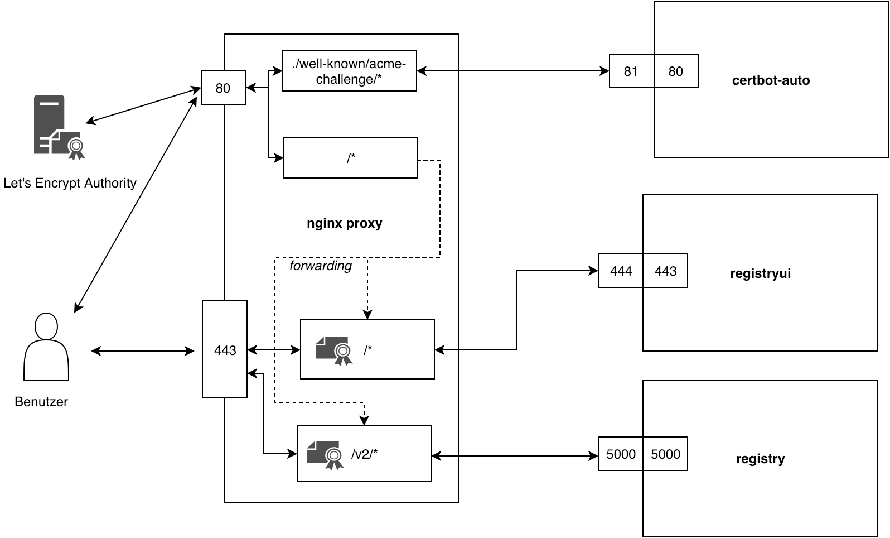

# Registry with Letsencrypt Certificates

This service stack issues [letsencrypt](https://letsencrypt.org/) certificates and starts a docker image registry
with a web frontend. The certificates are renewed automatically in case they expire. To start the service stack run the following command:  

    
    ./start-registry.sh example.com

To stop the service stack run 

    docker-compose stop
    

If you want to start the docker-compose with `docker-compose up` replace the domain name environment variable $DOCKER_REGISTRY_DOMAIN_NAME with 
your desired domain name or assign a new value to $DOCKER_REGISTRY_DOMAIN_NAME by executing
        
        export DOCKER_REGISTRY_DOMAIN_NAME=domain.tld

Please ensure that the file `start-registry.sh` is executable. If its not please run 

        chmod +x start-registry.sh

## Services

### Overview

### Nginx 

[Nginx](https://hub.docker.com/_/nginx) is can be configured as a reverse proxy. This is necessary, because requests on port 80 can be of two 
different types. Requests that want to ensure the correctness of the certificate and request that want to reach the 
registry frontend. The leather ones get forwarded to port 443. Nginx can also be configured to deliver ssl certificates. 
So there is no need to pass the certificates to the frontend service, because the reverse proxy handles them.

The image gets two volumes. The first volume is for the configuration file and the second volume should contain the certificates.

    volumes:
      - ./nginx:/etc/nginx/conf.d
      - ./certs:/certs
 
### Certbot

The certbot image is a wrapper of the official [certbot/certbot](https://hub.docker.com/r/certbot/certbot/)
image which can issue certificates from letsencrypt. The wrapper add the 
functionality that certificates are renewed in case they are expired.
 
For more information read the [certbot README](/certbot/README.md).

### Registry

#### Configuration

##### Ports

The registry image exposes the port **5000**. You can map this port to another on the host machine.  

##### Environment variables

- **REGISTRY_HTTP_TLS_CERTIFICATE:** The path to the certificate file (generated by the certbot container) 
- **REGISTRY_HTTP_TLS_KEY:** The path to the private key file (generated by the certbot container)
- **REGISTRY_AUTH:** The registry authentication methods. Possible authentication providers are *silly, token* and *htpasswd* 
- **REGISTRY_AUTH_HTPASSWD_REALM:** The realm in which the registry server authenticates.
- **REGISTRY_AUTH_HTPASSWD_PATH:** The path to the `htpasswd` file to load at startup.
- **FORCE_SSL:** Whether to use SSL encrytion or not. 

##### Volumes

The following volumes should be mounted:

    volumes:
      - ./registry:/var/lib/registry
      - ./certs:/certs
      - ./auth:/auth

The *registry* volume stores the data pushed to the registry. The *certs* volume stores your certificates and the *auth* volume contains the htpasswd file for authentication.

### Registry frontend

The registry frontend is implemented in the image [docker-registry-frontend](https://github.com/kwk/docker-registry-frontend) maintained by Konrad Kleine.

#### Configuration
 
##### Ports
The image exposes port 443
 
##### Environment variables
- **ENV_DOCKER_REGISTRY_HOST:** The host / container where the registry is running
- **ENV_DOCKER_REGISTRY_PORT:** The port on which the registry is running
- **ENV_USE_SSL:** Whether to use ssl or not 
- **ENV_DOCKER_REGISTRY_USE_SSL:** Whether the registry uses ssl or not

##### Volumes
In case you want an encrypted frontend it is necessary to mount your 
certificates to `/etc/apache2/server.key` and `/etc/apache2/server.crt`

    volumes:
      - ./certs/server.key:/etc/apache2/server.key:ro
      - ./certs/server.crt:/etc/apache2/server.crt:ro
      